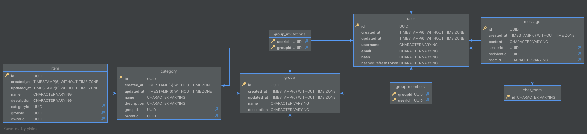

## Borrow.app - Your private swap meet

### Introduction

"borrow.app", an application developed for the Mobile Applications lecture at Constance University Of Applied Sciences.

Borrow app, as the name suggests, is an app that allows people to borrow things. People can create groups within their
community to be able to see what things other people are offering, and offer their own.

### Backend API

**The API repository can be found [here](https://github.com/marcothuemmler/borrow-api)**

* This project communicates with an API implemented in [NestJS](https://nestjs.com). You can configure the API_URL in
  the projects .env file located in the assets directory.

* The backend connects to a Postgres database using TypeORM for entity mapping.
* An instance of Min.IO S3 compatible object storage is used for group covers, profile pictures and item pictures.
* In dev environment the API is accessible through OpenAPI
  using [@nestjs/swagger](https://docs.nestjs.com/openapi/introduction).
* Authentication is implemented
  using [passport-jwt](https://docs.nestjs.com/recipes/passport#implementing-passport-jwt).

### Installation

* Install Flutter following the steps in [this resource](https://docs.flutter.dev/get-started/install)

* Run flutter pub get to install the dependencies.

```bash
flutter pub get
```

* Run flutter gen-l10n to generate localization files

```bash
flutter gen-l10n
```

* Create a .env file in the projects assets directory. See .env.template for assistance.<br>

### Usage

* Run flutter run -d <YOUR_DEVICE_ID>. You can also use your IDE to run the project. Check
  out [this page](https://docs.flutter.dev/tools) for information about your preferred IDE.

```bash
flutter run -d <YOUR_DEVICE_ID>
```

### Architecture

This project is based on the MVC+S design pattern, which is itself based on the classic MVC pattern. The main difference
from MVC is that it adds a service layer. This leads to higher decoupling of the different layers of the application.

- **Model**: Holds the state of the application. The model is used in the view layer to display relevant information to
  the user, and manipulated by the controller layer.

- **View**: Describes the UI using the model and provides an interface for the user to interact with the controller
  layer.

- **Controller**: The controller layer holds the various commands which represent the business login of the application.
  These commands are used to manipulate the state of the application.

- **Service**: The service layer provides a way of communicating with external data sources, such as the applications
  backend API.

The following graph is a representation of the MVC+S pattern used in this project:


### Technologies used

* **flutter_riverpod**: flutter_riverpod is a state management and dependency injection library for Flutter. Its
  creators describe it as a re-implementation of the provider library. flutter_riverpod constitutes the backbone of
  state management in this project.

* **GoRouter**: GoRouter is a declarative routing package for Flutter that uses the Router API to provide a
  convenient, url-based API for navigating between different screens. It is used in this project for its straightforward
  declarative routing, its support for nested routing and
  [ShellRoutes](https://pub.dev/documentation/go_router/latest/go_router/ShellRoute-class.html).

* **Dio**: Dio is a powerful HTTP client for Dart/Flutter, which supports global configuration, interceptors, FormData,
  request cancellation, file uploading/downloading, timeout, and custom adapters etc. It is used in the
  RestBackendService of this project for communication with the backend API, and to retrieve objects from
  the min.io instance. HTTP requests and responses are logged using pretty_dio_logger, which enables
  easier debugging.

* **Freezed**: Freezed is a code-generation package that helps you to create data classes in Dart. It generates
  boilerplate code from simple blueprint classes. It provides the backbone of the model layer in this project.

* **flutter secure storage**: Flutter Secure Storage is a Flutter plugin to store data in secure storage. It is
  primarily used to store JWT token data for authorization in the backend API.

* **flutter_localizations & intl**: This project is translated into four different languages, namely English, wich is
  the base language of the project, German, Spanish and French. The internationalization follows the official
  [Flutter internationalization documentation](https://docs.flutter.dev/accessibility-and-localization/internationalization)
  using the "flutter_localizations" and "intl" packages.

* **socket.io_client**: Socket.io_client is a port of the JavaScript library socket.io-client. It is a WebSocket
  library that used in this project to provide real time chat functionality.

### Data model:

UML representation of the data model:



### Contributors

* Marco Thümmler
* Johannes Wirbser

### License

This project is available for use under the [MIT license](LICENSE)
